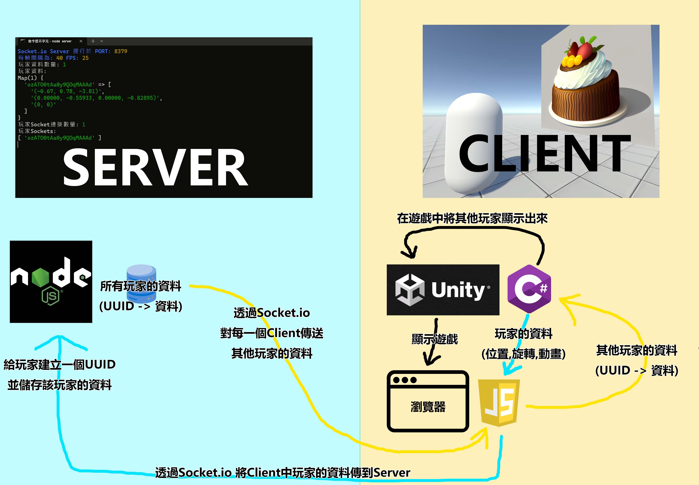

# Unity線上視訊遊戲實作

使用Unity WebGL製作的網頁遊戲  
只要開啟網頁，並授權網站鏡頭權限，就能加入遊戲  
使用WASD移動，滑鼠旋轉，空格跳躍  
透過網頁JavaScript的Socket.io與伺服器進行實時連線  
可以在遊戲中看到其他玩家的角色  
並且在角色上方會顯示該玩家的鏡頭畫面  

# 展示影片
<video src="video.mp4" controls="controls" width="300"></video>

# 製作方式

## 玩家角色
連線到伺服器的方式是使用網頁JavaScript的Socket.io  
因此要先將自己的資料從Unity中讀取到JavaScript  
才能將角色數據傳送到伺服器  

使用Unity中的C# 將角色數據傳送到JavaScript

* Unity中的C# - PlayerController - Update() [CsScripts/PlayerController.cs:47](CsScripts/PlayerController.cs#L47)
```cs
void Update()
{
    // ... 其他代碼 例如角色移動等

    // 呼叫 JavaScript中的 gameData(p, r, w, j) 並傳遞資料過去
    Application.ExternalCall("gameData", transform.position,transform.rotation, isWalking, isJumping);
}
```

* 網頁中的JavaScript [Webpage/script.js:8](Webpage/script.js#L8)
```javascript
// 建立四個變數來保存角色數據
var position; // 角色位置
var rotation; // 角色旋轉
var isWalking; // 角色是否正在行走
var isJumping; // 角色是否正在跳耀

// 建立一個Function 待會會在C#中呼叫，來傳遞數據
function gameData(p, r, w, j) {
    // 將四個數據存入變數中
    position = p;
    rotation = r;
    isWalking = w != 'False';
    isJumping = j != 'False';
}
```


這樣就可以在每次畫面更新前 將Unity中的角色數據同步到JavaScript中  
下一步就是要將角色數據傳送至伺服器，並且接收其他人的角色數據  

使用JavaScript的Socket.io 與伺服器連接  
* 網頁中的JavaScript [Webpage/script.js:30](Webpage/script.js#L30)
```javascript
const socket = io();

// ... 關於WebRTC的代碼 後面才會提到

// 當連線到伺服器時
socket.on('connect', () => {
    console.log('伺服器連接成功');

    startVideo(); // 關於WebRTC的代碼 後面才會提到

    // 設定一個定時器 每FrameInterval毫秒 就執行一次
    // 在展示中 FrameInterval 設定為40 也就是每秒執行25次
    setInterval(() => {
        // 先檢查資料是否存在
        if (position && rotation) {
            // 將 是否正在行走 和 是否正在跳躍 變成0(false)和1(true)的格式
            const animation = `(${isWalking ? '1' : '0'}, ${isJumping ? '1' : '0'})` 
            // 將角色資料發送給伺服器
            // 最終格式像這樣
            // '(0.00, 0.78, 0.00)','(0.00000, -0.95882, 0.00000, -0.28401)','(1, 0)'
            socket.emit("player-data", JSON.stringify([position, rotation, animation]));
        }
    }, FrameInterval);
})
```

* 伺服器 NodeJs [Server/server.js:8](Webpage/script.js#L8)
```javascript
const playerData = new Map(); // 建立一個Map儲存玩家數據

// ... 其他代碼

// 當新的客戶端連接到伺服器
io.on('connection', (socket) => {

    // ... 關於WebRTC的代碼 後面才會提到

    // 當接收到玩家資料時 將資料保存到Map中
    socket.on('player-data', (data) => {
        playerData.set(socket.id, JSON.parse(data));
    });

    // 當玩家斷線時刪除資料
    socket.on('disconnect', () => {
        playerData.delete(socket.id);
    })
    
    // ...
});
```
這樣就可以將角色數據從客戶端發送到伺服器了!  
現在伺服器已經保存了所有玩家的角色數據  
接下來要將這些數據傳送到每個客戶端

* 伺服器 NodeJs [Server/server.js:49](Server/server.js#L49)
```javascript
// 設定一個定時器 每FrameInterval毫秒執行一次
setInterval(() => {
    
    // ... 將資料打印在伺服器後台中

    // 對每個客戶端進行操作
    Array.from(io.sockets.sockets.values()).forEach(socket => {
        // 將所有玩家數據(Map) 儲存在一個新的Object
        obj = Object.fromEntries(playerData);
        // 將此Object中 屬於該客戶端的數據刪除 以避免遊戲中出現兩個自己
        delete obj[socket.id];
        // 將這個Object以JSON格式發送到客戶端
        socket.emit('player-data', JSON.stringify(obj));
    })
}, FrameInterval)
```

* 網頁中的JavaScript [Webpage/script.js:147](Webpage/script.js#L147)
```javascript
// 當收到其他玩家的資料時
socket.on("player-data", async (data) => {
    // 如果Unity已經載入完畢
    if (UnityInstance) {
        // 呼叫Unity C#中的OtherPlayerLoader空物件的 Void PlayerData()
        UnityInstance.SendMessage('OtherPlayerLoader', 'PlayerData', data);
    }
});
```

在客戶端收到其他玩家的角色數據後  
下一步就是要在遊戲中顯示其他玩家  
利用JavaScript呼叫C#並將數據傳入

* Unity中的C# - OtherPlayerLoader - PlayerData(String data) [CsScripts/OtherPlayerLoader.cs:27](CsScripts/OtherPlayerLoader.cs#L27)
```cs
/*
    這裡的代碼比較複雜
    簡單來說就是分析資料並且顯示其他玩家

    具體做了這些事
    playerObject 是一個用來儲存玩家物件的鍵值表 <String,GameObject>

    當收到資料時
    1. 將傳入的JSON解析成
    每個玩家的數據包含:
    uuid -> 三個浮點數列表(位置,旋轉,動畫)

    如果 playerObject 不包含此玩家的uuid，就新增玩家物件
    如果 playerObject 包含此玩家的uuid，就更新玩家物件的位置,旋轉,動畫

    如果 playerObject 中包含某個玩家 但是傳入的資料沒有
    代表該玩家已經退出了 刪除此玩家的玩家物件
*/
public void PlayerData(String data)
    {
        Dictionary<string, List<float[]>> dataDictionary = new Dictionary<string, List<float[]>>();
        foreach (var kvp in JsonConvert.DeserializeObject<Dictionary<string, List<string>>>(data))
        {
            List<float[]> floatList = new List<float[]>();
            foreach (var item in kvp.Value)
            {
                float[] floatArray = Array.ConvertAll(item.Trim('(', ')', ' ').Split(','), float.Parse);
                floatList.Add(floatArray);
            }
            dataDictionary.Add(kvp.Key, floatList);
        }

        Dictionary<string, GameObject> currentPlayerObjects = new Dictionary<string, GameObject>(playerObject);
        foreach (var item in dataDictionary)
        {
            if (!currentPlayerObjects.ContainsKey(item.Key))
            {
                playerObject.Add(item.Key, Instantiate(prototypeGameObject));
            }
            else
            {
                currentPlayerObjects.Remove(item.Key);
                GameObject obj;
                playerObject.TryGetValue(item.Key, out obj);
                obj.transform.position = new Vector3(item.Value[0][0], item.Value[0][1], item.Value[0][2]);
                obj.transform.rotation = new Quaternion(item.Value[1][0], item.Value[1][1], item.Value[1][2], item.Value[1][3]);
                Animator animator = obj.GetComponent<Animator>();
                animator.SetBool("isWalking", item.Value[2][0] == 1f);
                animator.SetBool("isJumping", item.Value[2][1] == 1f);
            }
        }
        foreach (var kvp in currentPlayerObjects)
        {
            Destroy(kvp.Value);
            playerObject.Remove(kvp.Key);
        }
    }
```

到這裡已經完成整個多人遊戲連線的內容了!  
大功告成~  

附上一張示意流程圖  
建議從C#往JS的箭頭開始看




## 玩家鏡頭
連接玩家視訊鏡頭的方式還蠻有趣的

我是使用WebRTC的技術來實現的

讓ChatGPT簡單介紹一下WebRTC是甚麼  
``WebRTC是一項開放標準，用於實現瀏覽器間的即時通訊，支援音頻、視頻和資料的傳輸。其獨特之處在於點對點通訊方式，允許瀏覽器直接建立連接，無需透過伺服器。這提供了低延遲、高效率的通訊，適用於視訊通話、視訊會議等應用。WebRTC透過瀏覽器內建的API實現，使用者可透過JavaScript簡單地整合即時通訊功能，促進了網頁應用程式的發展，提升了使用者體驗。``(By ChatGPT)

雖然說是點對點通訊，無需中間伺服器  
但是在沒有其他玩家的訊息的情況下，是不能和其他玩家連線的  
因此還是會需要伺服器來取得其他玩家的訊息  
以下是伺服器的實現方式  

首先 假設玩家A加入遊戲  
玩家A客戶端會使用WebSocket向伺服器發送關於自己的信息  
(只要有這些信息就能和自己建立連線)  
伺服器在接收到這個訊息後  
就會將A玩家的信息和A玩家的UUID發送給所有在線的玩家  
同時和所有玩家要求信息  
再將所有玩家和他們的UUID的信息都發送給A玩家  
這樣所有玩家就能即時和其他玩家都建立連線  
由於程式碼比較複雜 這邊就不做展示
* 網頁中的JavaScript [Webpage/script.js:32](Webpage/script.js#L32)
* 伺服器 NodeJs [Server/server.js:17](Server/server.js#L17)

在連線到其他玩家後  
還要將其他玩家的鏡頭畫面(html 元素 \<video>)  
定位到遊戲畫面的該玩家角色頭上(Unity 遊戲物件)  

使用Unity中的C# 計算出每位玩家的角色會顯示在螢幕的哪一個像素  
將C# 計算完的資料(螢幕位置和UUID)傳送到瀏覽器的js  
再用js使用UUID找到該玩家對應的鏡頭畫面  
並操作該鏡頭畫面的css style position  
就能將鏡頭畫面定位到遊戲角色上  

* Unity中的C# - OtherPlayerLoader - Update() [CsScripts/OtherPlayerLoader.cs:17](CsScripts/OtherPlayerLoader.cs#L17)
```cs
private void Update()
{
    foreach (var item in playerObject)
    {
        Vector3 cameraPosition = item.Value.transform.position + new Vector3(0.0f, 1.4f, 0.0f);
        Vector2 objectScreenPos = RectTransformUtility.WorldToScreenPoint(Camera.main, cameraPosition);
        Application.ExternalCall("playerObject", item.Key, objectScreenPos.x, objectScreenPos.y, Camera.main.WorldToScreenPoint(cameraPosition).z, Screen.width, Screen.height);
    }
}
```

* 網頁中的JavaScript [Webpage/script.js:20](Webpage/script.js#L20)
```js
function playerObject(playerUuid, screenPosX, screenPosY, screenPosZ, screenWidth, screenHeight) {
    if (!playerCameras.get(playerUuid)) return;
    const videoContainer = document.getElementById(playerCameras.get(playerUuid));
    videoContainer.style.opacity = (screenPosZ > 0.5) ? 1 : 0;
    videoContainer.style.left = (screenPosX / screenWidth) * 100 + "vw";
    videoContainer.style.bottom = ((screenPosY / screenHeight) * 100) + "vh";
    videoContainer.children[0].style.height = (40 / screenPosZ) + "vw";
}
```